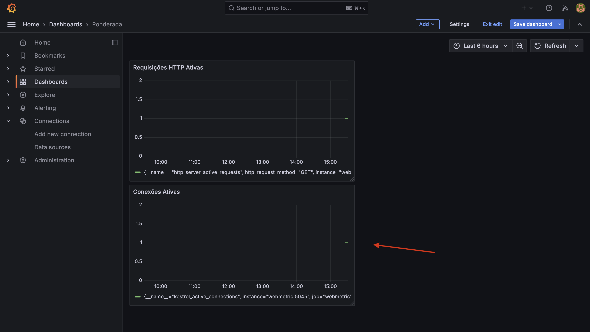
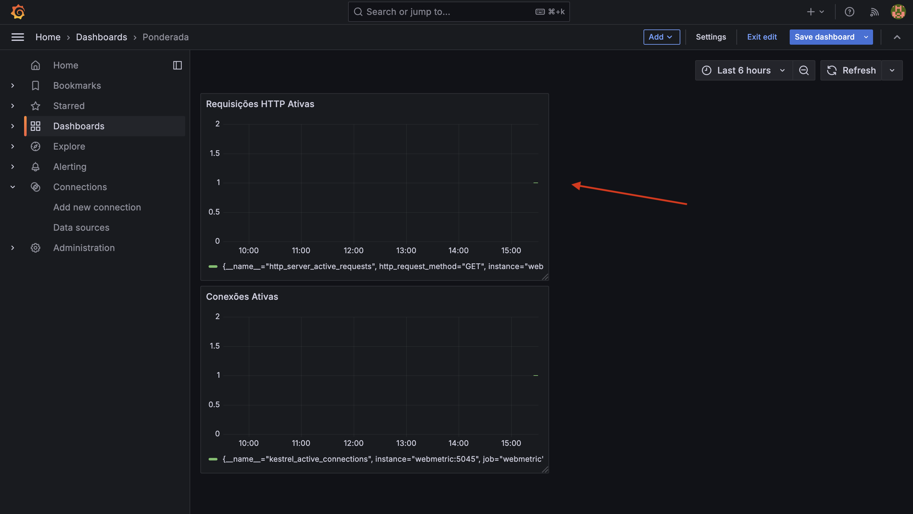

# ponderada_semana8

Este repositório foi criado para armazenar os códigos e documentações gerados durante o autostudo. O objetivo é implementar a coleta de métricas com Prometheus e Grafana e demonstrar os gráficos funcionando, integrando instrumentação no ASP.NET Core e OpenTelemetry.

## Pré-requisitos

Antes de iniciar, você precisará ter instalado em seu ambiente:

- Docker
- Docker Compose
- Git
- .NET SDK (para executar o ASP.NET Core)

## Estrutura do Repositório

```plaintext
/
├── docker-compose.yml
├── prometheus/
│   ├── prometheus.yml
├── grafana/
│   └── provisioning/
│       └── dashboards/
│           └── dashboard.json
├── src/
│   └── WebMetric/
│       ├── Program.cs
│       └── WebMetric.csproj
└── README.md
```

## Passo a Passo

### 1. Criar o Projeto ASP.NET Core

1. Na pasta `src/`, crie o aplicativo inicial:

   ```bash
   dotnet new web -o WebMetric
   cd WebMetric
   dotnet add package OpenTelemetry.Exporter.Prometheus.AspNetCore --prerelease
   dotnet add package OpenTelemetry.Extensions.Hosting
   ```

2. Substitua o conteúdo do arquivo `Program.cs` pelo código abaixo:

   ```csharp
   using OpenTelemetry.Metrics;

   var builder = WebApplication.CreateBuilder(args);
   builder.Services.AddOpenTelemetry()
       .WithMetrics(builder =>
       {
           builder.AddPrometheusExporter();
           builder.AddMeter("Microsoft.AspNetCore.Hosting", "Microsoft.AspNetCore.Server.Kestrel");
           builder.AddView("http.server.request.duration",
               new ExplicitBucketHistogramConfiguration
               {
                   Boundaries = new double[] { 0, 0.005, 0.01, 0.025, 0.05, 0.1, 0.25, 0.5, 1 }
               });
       });

   var app = builder.Build();

   app.MapPrometheusScrapingEndpoint();
   app.MapGet("/", () => "Hello OpenTelemetry! Ticks:" + DateTime.Now.Ticks.ToString()[^3..]);

   app.Run();
   ```

### 2. Configurar o Docker Compose

Crie o arquivo `docker-compose.yml` na raiz do repositório:

```yaml
version: '3.8'

services:
  prometheus:
    image: prom/prometheus:latest
    container_name: prometheus
    volumes:
      - ./prometheus/prometheus.yml:/etc/prometheus/prometheus.yml
    ports:
      - "9090:9090"

  grafana:
    image: grafana/grafana:latest
    container_name: grafana
    volumes:
      - grafana_data:/var/lib/grafana
    ports:
      - "3000:3000"

  webmetric:
    build:
      context: ./WebMetric
    ports:
      - "5045:5045"

volumes:
  grafana_data:
```

### 3. Configurar o Prometheus

Crie o diretório `prometheus/` e dentro dele o arquivo `prometheus.yml` com o seguinte conteúdo:

```yaml
scrape_configs:
  - job_name: 'prometheus'
    static_configs:
      - targets: ['localhost:9090']
  - job_name: 'webmetric'
    static_configs:
      - targets: ['webmetric:5045']
```

### 4. Iniciar os Contêineres

Execute o seguinte comando na raiz do repositório:

```bash
docker-compose up -d
```

### 5. Acessar as Interfaces

- Prometheus: [http://localhost:9090](http://localhost:9090)
- Grafana: [http://localhost:3000](http://localhost:3000)
- Aplicação ASP.NET Core: [http://localhost:5045](http://localhost:5045)

### 6. Configurar o Grafana

1. Faça login no Grafana com o usuário e senha padrão (`admin` / `admin`).
2. Adicione o Prometheus como fonte de dados:
   - URL: `http://prometheus:9090`
3. Configure o painel para as seguintes métricas:
   - `kestrel_active_connections`
   - `http_server_active_requests`

### 7. Demonstrar os Gráficos

1. Acesse o Prometheus para confirmar as métricas sendo coletadas.
2. No Grafana, configure painéis para exibir as métricas coletadas.
3. Capture prints dos gráficos gerados e insira nesta seção:

#### Exemplos de Gráficos

### Conexões Ativas no Servidor
Este gráfico exibe o número de conexões atualmente ativas no servidor, representando conexões TCP abertas. Essa métrica é útil para identificar a capacidade do servidor de lidar com conexões simultâneas e diagnosticar gargalos de rede.


### Requisições HTTP Ativas
Este gráfico mostra a quantidade de requisições HTTP em processamento no momento. É fundamental para monitorar períodos de alta carga e identificar gargalos de aplicação.

